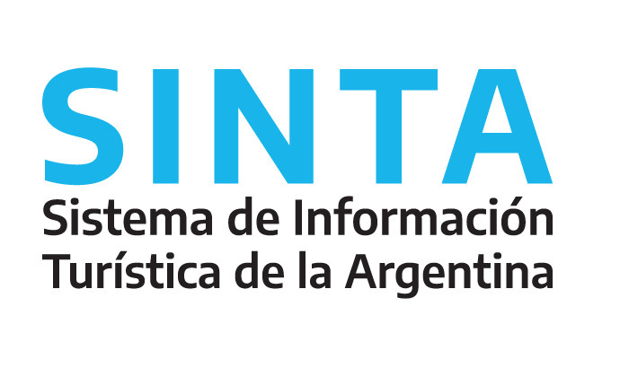

```{r submission-checks, echo=FALSE, warning=TRUE}
# Runs some basic checks in metadata. To disable, set check_is_error to FALSE
latinr::latinr_checks(rmarkdown::metadata, params$check_is_error)
```

```{r setup, include=FALSE}
knitr::opts_chunk$set(echo = TRUE)
```

## Las estadísticas de Turismo en la Argentina

La Dirección Nacional de Mercados y Estadísticas de la Subsecretaría de Desarrollo Estratégico del Ministerio de Turismo y Deportes de la Nación (MTyD), es la responsable de las estadísticas de turismo en el marco del sistema estadístico nacional. Como tal, entre otras actividades, lleva adelante:

(i) la coordinación de operativos estadísticos[^1];

(ii) la explotación y análisis de una variedad de registros administrativos[^2]

[^1]: Los mismos son la ***Encuesta de Ocupación Hotelera (EOH)*** y la ***Encuesta de Turismo Internacional (ETI)***, junto al Instituto Nacional de Estadísticas y Censos (INDEC); y, por cuenta propia, la ***Encuesta de Viaje y Turismo de los Hogares (EVyTH).***

[^2]: Ejemplos de ellos son (a) algunos producidos en la orbita del MTyD - como registro de Agencias de Viajes; u (b)otros gestionados y cedidos por organismos como la Dirección Nacional de Migraciones (DNM - para la estimación del turismo internacional por todas las vías); la Agencia Nacional de Aeronavegación Comercial (ANAC - sobre oferta y demanda de vuelos, tanto internacional como de cabotaje); la Comisión Nacional Reguladora de Transporte (CNRT - con datos de registro de servicios de transporte terrerstre), o la Administración de Parques Nacionales (APN - con registros de visitaciones a áreas protegidas naturales de adminsitración nacional).

Este amplio conjunto de tareas requiere de una serie de procesos que implican la captura, limpieza, consistencia, consolidación, análisis y comunicación de datos que provienen de múltiples fuentes, con diversos formatos y estructuras.

## d4t4tur: un nuevo flujo de trabajo

De un tiempo a esta parte, la DNMyE viene encarando un proyecto de transformación de los procesos detrás de las acciones antes reseñadas. Con un diagnóstico incial de que se podía avanzar en la implementación de un flujo de trabajo más sistemático y reproducible; que implicara la apertura de fuentes de datos y de procesos; y que pudiera ser compartido en diversos soportes con usuarios potenciales diversos, se decidió avanzar en la implementación de acciones para lograr esos objetivos.

**Primeros pasos**: el punto de partida consistió en armar un *stack* de trabajo, donde **R** juega un rol central:

-   se procuró la creación y configuración de un servidor dedicado para la DNMyE donde corre un [RStudio Server](https://www.rstudio.com/products/rstudio/download-server/). En él, cada usuarie cuenta con un acceso para poder hacer uso del *software* desde un navegador[^3]. El mismo permite además desplegar aplicaciones (*Shiny)* y un sistema de archivos que permite a todes hacer uso de las fuentes de datos necesarias para cada proceso.

-   rapidamente se creo un repositorio de organización (*de desarrollo*) en *GitHub*, que nos permitió ir acumulando la producción de código y trabajar con un sistema de control de versiones. Con el paso del tiempo se creo un segundo repositorio (*de producción*) donde paulatinamente se van publicando aplicaciones *Shiny*, libros digitales y reportes, entre otros: <http://github.com/dnmye-minturdep/>

-   por último, se abrió una instancia de capacitación interna periódica con el objetivo de acercar a usuaries (muchos con experiencia de análisis estadístico y algunos con práctica en programación con otros *software*, en su mayoría propietarios) el uso de estas nuevas herramientas y bajar la curva de aprendizaje[^4].

[^3]: En el contexto del trabajo remoto, a causa de las restricciones a la movilidad por la pandemia del Covid19, esta organización nos permitió abordar problemas de administración de bases de datos y el mantenimiento de librerías, por ejemplo, que aseguraran la reproducibilidad del trabajo.

[^4]: Este espacio de encuentro interno se formalizó luego también en un esquema de capacitaciones destinado a agentes que cumplen funciones técnicas en las oficinas encargadas de las estadíticas de turismo, no solamente del gobierno nacional, sino también de gobiernos provinciales y locales. El material (*bookdown* y videos de las capacitaciones se encuentran alojadas en [armonziacion.yvera.tur.ar](https://armonizacion.yvera.tur.ar/ "ARMONIZACION ESTADISTICA EN LAS PROVINCIAS")).

El proceso no fue lineal, sino que se fueron incorporando herramientas y tecnologías en la medida que se generaban nuevos productos. Paulatinamente la producción de informes, que tradicionalmente se hacían en procesadores de texto o planillas de cálculo, se empezaron a generar con código fuente. Con el tiempo estos informes se fueron convirtiendo en reportes interactivos y luego derivando en tableros como soporte alternativo para la consulta de información. La generación de estas nuevas formas de acceder a datos y estadísticas producidas por la DNMyE nos llevó a organizar de un nuevo modo la comunicación de estos productos.

```{r fig.align='center', out.width = '50%', echo = FALSE}




```

## COMUNICACIÓN

El [**Sistema de Información Turística de la Argentina (SINTA)**](https://www.yvera.tur.ar/sinta/) es el resultado de esta experiencia. Un portal único, en constante actualización, que ofrece una multiplicidad de maneras de acceder a la información y datos producidos por la DNMyE, muchos de ellos trabajados con **R** de punta a punta. Destacamos acá:

1.  el procesamiento de los datos publicados en el **Portal de Datos Abiertos** ([datos.yvera.tur.ar](http://datos.yvera.gob.ar/ "Datos Abiertos de Turismo")) que se administra con el paquete \CRANpkg{ckanr}[@ckanr].

2.  **Documentos Técnicos** gracias al soporte de \CRANpkg{bookdown}[@bookdown], en el marco del programa de **ARMONIZACIÓN** de las estadísticas de turismo en las provincias ([armonizacion.yvera.tur.ar](https://armonizacion.yvera.tur.ar/ "ARMONIZACION ESTADISTICA EN LAS PROVINCIAS")) y la generación de **INFORMES** ([yvera.tur.ar/informes](https://www.yvera.tur.ar/sinta/informe)) a partir de *templates* generados con (\CRANpkg{pagedown}[@pagedown]).

3.  una serie de micrositios generados con\CRANpkg{distill}[@distill]

-   el *blog* **BITÁCORA** ([bitacora.yvera.tur.ar](https://bitacora.yvera.tur.ar/ "BLOG - Bitácora del Turismo en Argentina"))

-   micrositios de estadísticas con una mirada federal:

    -   el proyecto de **ARMONIZACION** antes citado y un **MONITOR** con indicadores agrupados a nivel provincial ([provincias.yvera.tur.ar](https://provincias.yvera.tur.ar/ "MONITOR del turismo en las provincias")) .

-   un micrositio para la consulta interactiva de últimos datos - REPORTES- e información desagregada - **TABLEROS** ([tableros.yvera.tur.ar](https://tableros.yvera.tur.ar/)).

    -   entre los desarrollos de aplicaciones con \CRANpkg{shiny}[@shiny] se destacan los tableros de consulta de datos de **(i)** turismo internacional, **(ii)** del padrón único nacional de alojamientos y de **(iii)** conectividad aerocomercial - de pronta publicación.

**HERRAMIENTAS**

Por último, con la acumulación de experiencias, empezamos a sistematizar buena parte del trabajo en herramientas que nos permiten un flujo de trabajo más eficiente, buscando reducir en lo posible la repetición de tareas o procesos; reduciendo la posibilidad de errores; automatizando flujos de trabajo, y permitiendo el control de cambios para adminsitrar la evolución de los proyectos.

En este sentido, por ejemplo, empezamos el desarrollo de paquetes que nos facilitan los pasos típicos en nuestro flujo usual de trabajo:

-   Con [**`{herramientas}`**](https://github.com/dnme-minturdep/herramientas) (@herramientas)buscamos simplificar tareas cotidanas de acceso a datos en los servidores, limpieza de determinada clases de variables o cálculos usuales de indicadores.

-   Con [**`{comunicacion}`**](https://github.com/dnme-minturdep/comunicacion)(@comunicacion), por otro lado, podemos generar informes, reportes o visualizaciones que utilizan los parametros y estilos de la comunicación oficial.

-   Por último vale mencionar a ️ ***mapeAr**[tableros.yvera.tur.ar/mapeAr](https://tableros.yvera.tur.ar/mapeAr)*. Una herramienta creada con *Shiny*, también presente en esta convocatoria, que permite la generación de visualizaciones georeferenciadas a través de una interfaz sin necesidad de tener conocimientos de programación o de **R** en particular.

# Referencias
