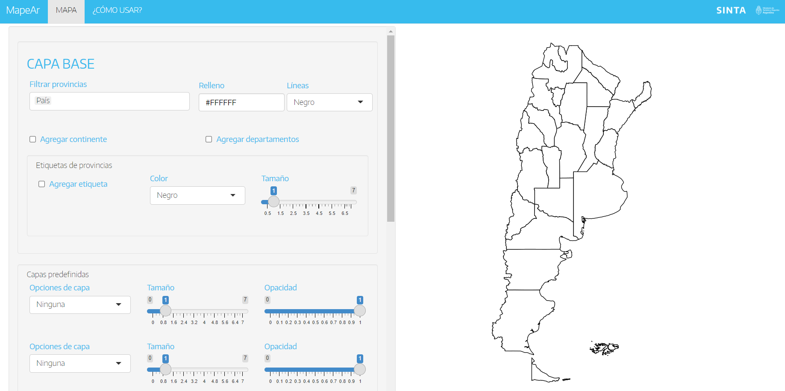

```{r submission-checks, echo=FALSE, warning=TRUE}
# Runs some basic checks in metadata. To disable, set check_is_error to FALSE
latinr::latinr_checks(rmarkdown::metadata, params$check_is_error)
```


```{r setup, include=FALSE}
knitr::opts_chunk$set(echo = FALSE)
```

## Introducción

La visualización de datos es un recurso útil a la hora de comunicar y pensar estrategias de desarrollo. En materia de política turística, como en muchas otras áreas de la administración pública, trabajar con datos geográficos resulta de vital importancia para la planificación y promoción.

¿Dónde se localizan los principales atractivos turísticos de una provincia? ¿Cuál es el nivel de concentración geográfica de los destinos turísticos de un país? ¿Cómo se conectan las principales ciudades receptoras de turismo? Este tipo de preguntas puede ser respondida de manera gráfica y sencilla a través de la confección de mapas.

Sin embargo, la realización de un mapa que permita visualizar información geográfica resulta ser una tarea un tanto compleja, en especial si no se cuenta con conocimientos técnicos sobre **Sistemas de Información Geográfica (SIG)**.

En este sentido, contar con una herramienta de acceso libre para la representación de datos espaciales sin requerimientos de programación o diseño, supone una solución para diversos usuarios interesados en el tema.

El paquete \CRANpkg{shiny} [@shiny] ofrece una oportunidad para un desarrollo de estas características, al permitir construir una aplicación con una interfaz accesible **([UI](https://github.com/dnme-minturdep/mapeAr/blob/main/ui.R))** y un trasfondo donde se procese la información geográfica **([server](https://github.com/dnme-minturdep/mapeAr/blob/main/server.R))**.

## mapeAr

[**mapeAr**](https://tableros.yvera.tur.ar/mapeAr/) surge en este contexto como un recurso de la Dirección Nacional de Mercados y Estadística (DNMyE) en el marco del [**Sistema de Información Turística de la Argentina (SINTA)**](https://www.yvera.tur.ar/sinta/). La plataforma consiste de dos pestañas, una con información sobre cómo utilizar la aplicación y otra con los controles y visualización para poder realizar un mapa. 

```{r out.width="80%", out.height= "30%"}

```

Por defecto la _shiny_ carga una capa con la geometría de Argentina y su división política (provincias). Esta es la denominada **capa base**, sobre la cual se pueden hacer algunas modificaciones (filtrar provincias específicas, agregar las etiquetas con los nombres, o los polígonos correspondientes a la región, por ejemplo). 

Utilizando la lógica de \CRANpkg{ggplot2} [@ggplot2], la aplicación permite incorporar más capas de datos georeferenciados sobre la capa base. En la medida que se realicen incorporaciones o ajustes, los mismos se van impactando en la previsualización del mapa.

En una primera instancia, se ofrece la posibilidad de cargar hasta dos capas predefinidas. Estas capas refieren a geometrías que ya se encuentran configuradas y son de uso común por parte de usuarios vinculados a la DNMyE, con el fin de facilitar su carga. Por ejemplo, la capa de "Vías Nacionales" ayuda a visualizar todas las rutas nacionales de Argentina sin la necesidad de tener que buscar un archivo con dicha información, descargarlo y subirlo a la _app_.

En una segunda (tercera y cuarta) instancia, el usuario cuenta con la posibilidad de cargar sus propias bases de datos con información geográfica. 

```{r out.width="80%", out.height= "50%"}

```

Al trabajar con datos de estas características se pueden representar distintas geometrías, así como utilizar diferentes formatos de archivo: 

+ **Geometrías**: las principales formas de representación de datos espaciales son los **(i) puntos**, georeferenciados con una latitud y longitud (por ejemplo, las coordenadas de un hotel); las **(ii) líneas**, que representan un sucesión de puntos (por ejemplo, una ruta); y los **(iii) polígonos**, que configuran áreas (como una provincia).

+ **Formatos**: en el caso de puntos es común utilizar archivos con extensión _.xlsx_ o _.csv_ donde se cuenta con una columna para la latitud y otra para la longitud. Para representar líneas y polígonos, se suele guardar la información en formatos específicos como _.kml_ o _.geojson_.

Además el archivo debe cumplir con ciertos requisitos, como el formato en el que están escritas las coordenadas, de manera que la lectura de los datos sea correcta. En la aplicación se describen estos requerimientos y se provee de un archivo descargable como modelo para estructurar los datos.

La interfaz de **mapeAr** permite al usuario personalizar algunos parámetros estéticos de las capas cargadas, como por ejemplo, el color y el tamaño, para que el resultado se ajuste a sus necesidades.

Finalmente, con el botón de descarga se ofrece la posibilidad de exportar el mapa como imagen en distintos formatos, para poder compartirlo, utilizarlo en documentos o presentaciones, etc.

\newpage

# Referencias
